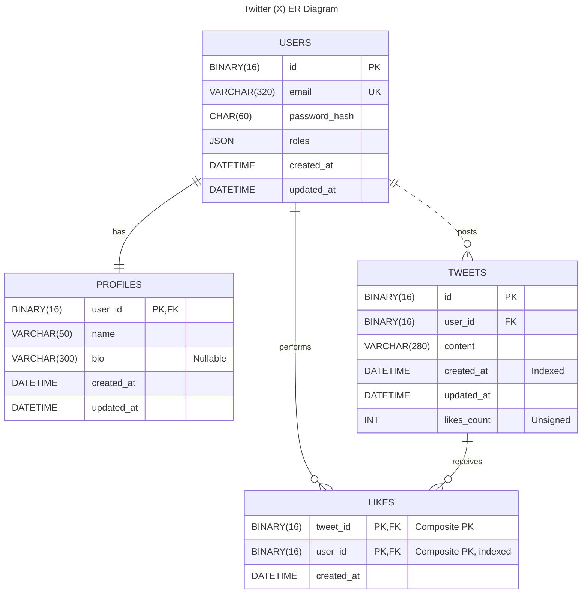

# Twitter (X) Clone &mdash; Database Design

This document describes the database structures of the Twitter (X) clone
developed within EPAM PHP Laboratory.

## Technical Standards and Conventions

| Category          | Decision             | Rationale                                                                                                                                                                                      |
|:------------------|:---------------------|:-----------------------------------------------------------------------------------------------------------------------------------------------------------------------------------------------|
| **DBMS**          | `MySQL 8.0`          | Speed, reliability and popularity.                                                                                                                                                             |
| **Charset**       | `utf8mb4`            | Full Unicode support (emojis, etc.).                                                                                                                                                           |
| **Collation**     | `utf8mb4_0900_ai_ci` | Modern Unicode sorting standards. Case-insensitive ensures intuitive search (e.g., "Oleh" matches "oleh") and filtering.                                                                       |
| **Identity (PK)** | `UUID v7`            | Unlike `v4`, `v7` is time-ordered. This prevents B-Tree index fragmentation in MySQL, significantly improving insert performance and query speed for historical data compared to random UUIDs. |
| **ID Storage**    | `BINARY(16)`         | Speed and space saving.                                                                                                                                                                        |

### UUID Handling Snippets

Since UUIDs are stored as `BINARY(16)`, we utilize MySQL's conversion functions
for human-readable input/output:

- Selecting data (binary to string):

    ```sql
    SELECT BIN_TO_UUID(id) as id, email FROM users;
    ```

- Inserting data (string to binary):

    ```sql
    INSERT INTO users (id, email, ...) 
    VALUES (UUID_TO_BIN('6ccd780c-baba-1026-9564-5b8c656024db'), 'email@example.com', ...);
    ```

> [!NOTE]
> For UUID v7 generation, we rely on the application layer (Symfony/PHP) to
> generate the ID before insertion to ensure strict time-sorting, utilizing
`UUID_TO_BIN()` only when raw SQL interaction is necessary.

## Entity-Relationship Diagram



## Data Dictionary and Entities

### Table: `users`

Stores only data required for authentication and authorization.

| Field           | Type           | Attributes       | Description                                                                            |
|:----------------|:---------------|:-----------------|:---------------------------------------------------------------------------------------|
| `id`            | `BINARY(16)`   | **PK**           | Unique identifier (UUID v7).                                                           |
| `email`         | `VARCHAR(320)` | **UK**, Not Null | User login.                                                                            |
| `password_hash` | `CHAR(60)`     | Not Null         | Bcrypt hash. Fixed length of 60 characters ensures optimal storage for Bcrypt strings. |
| `roles`         | `JSON`         | Not Null         | Array of roles.                                                                        |
| `created_at`    | `DATETIME`     | Not Null         | Registration date and time.                                                            |
| `updated_at`    | `DATETIME`     | Not Null         | Last update date and time.                                                             |

* Email must be unique across the system.
* Users are assigned the `ROLE_USER` role by default upon creation.

### Table: `profiles`

Public user information. Separated from `users`.

| Field        | Type           | Attributes | Description                        |
|:-------------|:---------------|:-----------|:-----------------------------------|
| `user_id`    | `BINARY(16)`   | **PK, FK** | Foreign key to `users.id`.         |
| `name`       | `VARCHAR(50)`  | Not Null   | Displayed name.                    |
| `bio`        | `VARCHAR(300)` | Nullable   | User biography.                    |
| `created_at` | `DATETIME`     | Not Null   | Profile creation date and time.    |
| `updated_at` | `DATETIME`     | Not Null   | Last profile update date and time. |

### Table: `tweets`

The main content unit.

| Field         | Type           | Attributes     | Description                           |
|:--------------|:---------------|:---------------|:--------------------------------------|
| `id`          | `BINARY(16)`   | **PK**         | Tweet identifier.                     |
| `user_id`     | `BINARY(16)`   | **FK**         | Reference to the author (`users.id`). |
| `content`     | `VARCHAR(280)` | Not Null       | Tweet text body.                      |
| `created_at`  | `DATETIME`     | **Index**      | Publication date and time.            |
| `updated_at`  | `DATETIME`     | Not Null       | Edit date and time.                   |
| `likes_count` | `UNSIGNED INT` | `0` by default | Number of tweet likes.                |

### Table: `likes`

Junction table (Many-to-Many) for likes.

| Field        | Type         | Attributes | Description                    |
|:-------------|:-------------|:-----------|:-------------------------------|
| `tweet_id`   | `BINARY(16)` | **PK, FK** | Part of composite primary key. |
| `user_id`    | `BINARY(16)` | **PK, FK** | Part of composite primary key. |
| `created_at` | `DATETIME`   | Not Null   | Event date and time.           |

The table has composite primary key: `(tweet_id, user_id)`. This prevents a
user from liking the same tweet twice.

## Indexes

| Table    | Index / Key             | Use Case                                     |
|:---------|:------------------------|:---------------------------------------------|
| `users`  | `UNIQUE(email)`         | Fast user lookup during login.               |
| `tweets` | `IDX(created_at DESC)`  | Chronological Feed generation.               |
| `tweets` | `IDX(user_id)`          | Fetching all tweets by a specific user.      |
| `likes`  | `PK(tweet_id, user_id)` | Checking whether a user liked a tweet.       |
| `likes`  | `IDX(user_id)`          | Fetching a list of tweets liked by the user. |

## Normalization

The database schema adheres to **Boyce-Codd Normal Form (BCNF)**.
